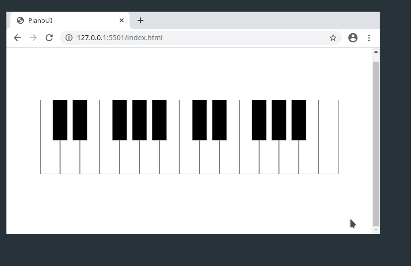

# PianoUI

A responsive piano interface for web audio applications. Currently under development.

## Download

Download the source: [PianUI.min.js](https://raw.githubusercontent.com/devinereshan/pianoUI/master/dist/PianoUI.min.js)

## Usage

```html
<script src="PianoUI.min.js"></script>

<div id="piano-container"></div>
                         
<script>
  let piano = new PianoUI.Piano("#piano-conatiner");
</script>
```

Or:

```javascript
import { Piano } from "./PianoUI.min.js";

let piano = new Piano("piano-container");
```


Responsive sizing:



Customizable interface:


Media Queries:


