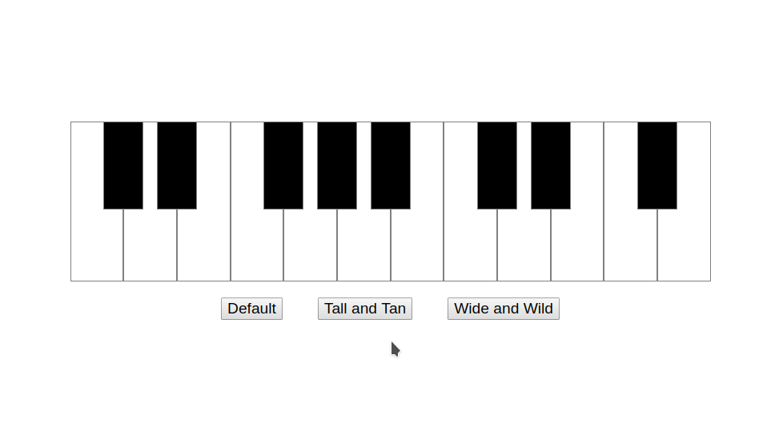
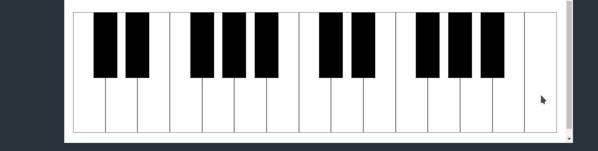

# PianoUI

A customizable piano interface for web audio applications.

# Table of Contents

* [Installation](#installation)
* [Usage](#usage)
    * [Constructor](##constructor)
    * [Options](##options)
    * [Getters / Setters](#getters--setters)
    * [Events](##events)
* [License](#license)
* [Examples](#examples)

# Installation
Download the source: [PianUI.min.js](https://raw.githubusercontent.com/devinereshan/pianoUI/master/dist/PianoUI.min.js)

# Usage
You can include the library with a script tag:
```html
<script src="PianoUI.min.js"></script>

<div id="piano-container"></div>

<script>
  let piano = new Piano("#piano-container");
</script>
```

Or import/require:

```javascript
import { Piano } from "./PianoUI.min.js";

let piano = new Piano("#piano-container");
```

```javascript
const PianoUI = require("./PianoUI.min.js");

let piano = new PianoUI.Piano("#piano-container");
```

## Constructor

```javascript
let piano = new PianoUI.Piano(target, options = {
  size:  ['800px', '200px'],
      range: [36, 60],
      colors: {
          whiteKey: 'white',
          blackKey: 'black',
          whiteKeyHighlight: 'aqua',
          blackKeyHighlight: 'aqua',
          blackKeyBorder: 'gray',
          whiteKeyBorder: 'gray',
      },
      whiteKeyBorderWidth: '1px',
      blackKeyBorderWidth: '1px',
      blackKeyWidthRatio: 0.75,
      blackKeyHeight: '55%',
      mouseVelocity: 127,
});
```

PianoUI exports a single class called `Piano`. The `Piano` constructor takes two arguments. The second parameter, `options`, is optional and will default to the above values if not provided. The first parameter, `target`, specifies the containing `<div>` of the `Piano` interface. The `target` should be a string that will return a valid DOM element when passed to `document.querySelector()`. For example:

```javascript
let piano = new PianoUI.Piano('#piano-container');
```

This will find an element with an id of `'piano-container'`. An error will be thrown if the element does not exist.

The `options` parameter can be specified in full or in part upon construction. Any values not specified will be set to their defaults. Additionally, options are deep copied, so the object passed in to the constructor will not be mutated in any way. Likewise, changes made to the `options` object after construction should have no effect on the newly instantiated `Piano`.

### A Note on Piano Key Values
All piano keys in PianoUI correspond to an integer value, with `0` representing the lowest `"C"` available. Likewise, the values `1`, `2`, and `3` correspond to `"C#/Db"`, `"D"`, and `"D#/Eb"` respectively. All ranges, noteOn/Off events, and such are expressed numerically. This makes it fairly straightforward to interface with midi controllers/events. However, it's left up to the programmer to determine if/how those values will be interpretted sonically.

## Options:

The following options can be passed to the `Piano` constructor:

### `size: [width, height]`

An array specifying the `width` and `height` of the piano. Both values must be provided whenever setting `size`. They may be any valid string for specifying the dimensions of a `<div>`. For example:
- `size: ['100px', '50px']`
- `size: ['100%', '100%']`
- `size: ['100vw', '20vh']`

Percentage values for height and width are calculated relative to the `target` container. All keys are then completely responsive and will resize and reposition properly if `target` container changes. This makes it possible to control the dimensions of the `target` container externally (with css, for example) without breaking the ui.


### `range: [lowNote, highNote]`
An array describing the lowest note and the highest note of the piano. Keys are indexed starting at `C`, so a value of `0` represents the lowest `C` available. Both values must be greater than or equal to `0` and the computed range (`range[1] - range[0]`) should be positive. Additionally, pianoUI doesn't currently support ranges starting or ending on accidentals. If an accidental is supplied, it will be adjusted to land on the previous white key.

### `colors: { ... }`
An object specifying the colors of the ui. The available options and defaults are:
```javascript
{
  whiteKey: 'white',
  blackKey: 'black',
  whiteKeyHighlight: 'aqua',
  blackKeyHighlight: 'aqua',
  blackKeyBorder: 'gray',
  whiteKeyBorder: 'gray',
}
```

### `whiteKeyBorderWidth: '1px'`
The width of the border surrounding the white keys. Accepts any string that can be applied to `style.borderWidth`. Defaults to `'1px'`.

### `blackKeyBorderWidth: '1px'`
The width of the border surrounding the black keys. Accepts any string that can be applied to `style.borderWidth`. Defaults to `'1px'`.


### `blackKeyWidthRatio: 0.75`
The width of the black keys relative to the width of the white keys. Accepts a value between `0` and `1` inclusive, with `0` hiding the body of the black keys entirely and `1` extending the edges of each key to the center of each adjacent white key, effectively making them the same width as the white keys.

### `blackKeyHeight: '55%'`
The height of the black keys expressed as a percentage of the height of the piano. Accepts a string in the range of `'0%'` to `'100%'`. The default is `'55%'`.

### `mouseVelocity: 127`
The default note velocity to be passed to `noteOn` events when a piano key is pressed by a user mouse action.


## Getters / Setters:
The `Piano` class provides getters and setters for all of the options. Options should not be modified directly, but instead should be updated with the appropriate setter method. Attempting to modify an option directly could break the internal logic of the `Piano` class, resulting in undefined behaviour.

* [setColors(colors)](#setcolorscolors)
* [getColor(identifier)](#getcoloridentifier)
* [setKeyActive(number, velocity)](#setkeyactivenumber-velocity)
* [setKeyInactive(number, velocity)](#setkeyinactivenumber-velocity)
* [setSize(size)](#setsizesize)
* [getSize](#getsize)
* [setRange(range)](#setrangerange)
* [getRange()](#getrange)
* [setSizeAndRange()](#setsizeandrangesize-range)
* [setMouseVelocity(velocity)](#setmousevelocityvelocity)
* [getMouseVelocity()](#getmousevelocity)
* [setBlackKeyWidthRatio(ratio)](#setblackkeywidthratioratio)
* [getBlackKeyWidthRatio()](#getblackkeywidthratio)
* [setBlackKeyHeight(height)](#setblackkeyheightheight)
* [getBlackKeyHeight()](#getblackkeyheight)
* [setBlackKeyBorderWidth(width)](#setblackkeyborderwidthwidth)
* [getBlackKeyBorderWidth()](#getblackkeyborderwidth)
* [setWhiteKeyBorderWidth(width)](#setwhitekeyborderwidthwidth)
* [getWhiteKeyBorderWidth()](#setwhitekeyborderwidth)


### `setColors(colors)`
Accepts an object with key value pairs corresponding to color options. Color options may be specified in full or in part. Any options not specified will be left unmodified. Any invalid options will be ignored. For example:
```javascript
piano.setColors({
  whiteKey: '#333333',
  blackKey: 'hotPink',
  blackKeyBorder: 'lightPink'
});
```


### `getColor(identifier)`
Returns the string value associated with the key `identifier` in the piano color options. For example:
```javascript
// Returns 'gray' if piano is constructed with default options
piano.getColor('blackKeyBorder');
```

### `setKeyActive(number, velocity)`
Set the specified key as active, which will highlight the key and fire a `noteOn` event as if the key had been clicked and held by the mouse. The first argument, `number`, corresponds to the key being pressed. The second argument indicates the velocity of the keypress and defaults to `options.mouseVelocity` if unspecified. If the current `range` of the piano is set to `[12, 24]`, calling `piano.setKeyActive(12)`, would highlight the first key on the interface. The key will be left active until `piano.setKeyInactive(12)` is called. **Note:** Calling this method on a key which is not displayed will still emit a `noteOn` event, although no visual signal will be produced. This is to allow signals coming from external sources (like a midi controller) to be routed through the interface if desired to prevent duplicate events firing when a single key is pressed.


### `setKeyInactive(number, velocity)`
Set the specified key as inactive, which will fire a `noteOff` event as if the key had been released by the mouse. If the key was previously active, the highlight will be removed. Note, a `noteOff` event will still fire even if the key was not previously active. **Note:** Calling this method on a key which is not displayed will still emit a `noteOn` event, although no visual signal will be produced. This is to allow signals coming from external sources (like a midi controller) to be routed through the interface if desired to prevent duplicate events firing when a single key is pressed.


### `setSize(size)`


### `getSize()`
Returns an array of length two, describing the lowest note and highest note of the piano.


### `setRange(range)`
Accepts an array of length two, describing the lowest note and the highest note of the piano. Keys are indexed starting at `C`,  so a value of `0` represents the lowest `C` available. Both values must be greater than or equal to `0` and the computed range (`range[1] - range[0]`) should be positive. Additionally, pianoUI doesn't currently support ranges starting or ending on accidentals. If an accidental is supplied, it will be adjusted to land on the previous white key.


### `getRange()`
Returns an array of length two, describing the lowest note and highest note of the piano.

### `setSizeAndRange(size, range)`
A convenience method to set the size and range simultaneously. Under the hood, parts of the ui have to be rebuilt when either option is changed. Updating both values together allows for rebuilding those parts only once. Practically, however, this isn't likely to have much affect on performance for normal use cases.

### `setMouseVelocity(velocity)`
Set the velocity to be passed to `noteOn` events triggered by user mouse actions on the interface. This defaults to 127 to mimic common midi representations of max velocity, but doesn't impose any arbitrary limits or scaling system. You're welcome to provide whatever value your program requires.

### `getMouseVelocity()`
Returns the value of the `mouseVelocity` options which is passed to `noteOn` events triggered by user mouse actions on the interface.

### `setBlackKeyWidthRatio(ratio)`
Sets the width of the black keys relative to the width of the white keys. Accepts a value between `0` and `1` inclusive, with `0` hiding the body of the black keys entirely and `1` extending the edges of each key to the center of each adjacent white key, effectively making them the same width as the white keys.

### `getBlackKeyWidthRatio()`
Returns the current value of the `blackKeyWidthRatio` option.

### `setBlackKeyHeight(height)`
Sets the height of the black keys expressed as a percentage of the height of the piano. Accepts a string in the range of `'0%'` to `'100%'`. The default is `'55%'`.

### `getBlackKeyHeight()`
Returns the height of the black keys expressed as a percentage of the height of the piano.

### `setBlackKeyBorderWidth(width)`
Sets the width of the border surrounding the black keys. Accepts any string that can be applied to `style.borderWidth`. Defaults to `'1px'`.

### `getBlackKeyBorderWidth()`
Sets the width of the border surrounding the black keys.

### `setWhiteKeyBorderWidth(width)`
Sets the width of the border surrounding the white keys. Accepts any string that can be applied to `style.borderWidth`. Defaults to `'1px'`.

### `getWhiteKeyBorderWidth()`
Sets the width of the border surrounding the white keys.

## Events


# License

# Examples


Responsive sizing:


Customizable interface:



Media Queries:



